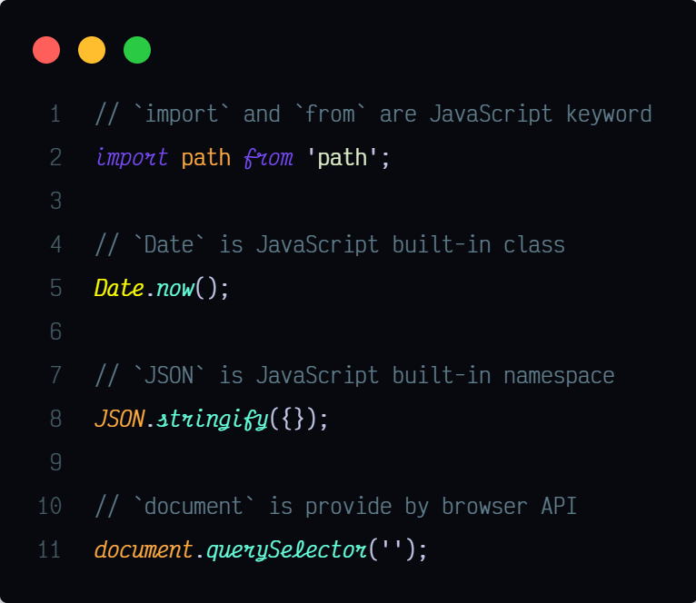
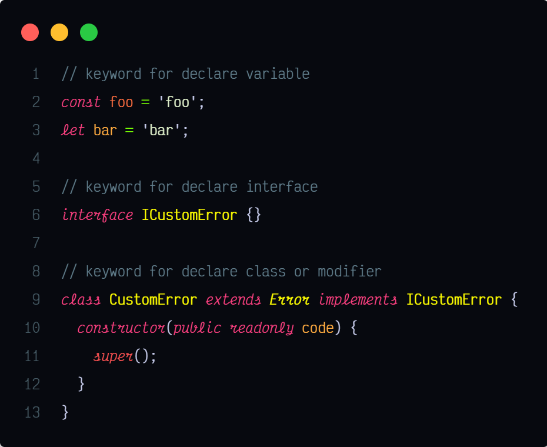
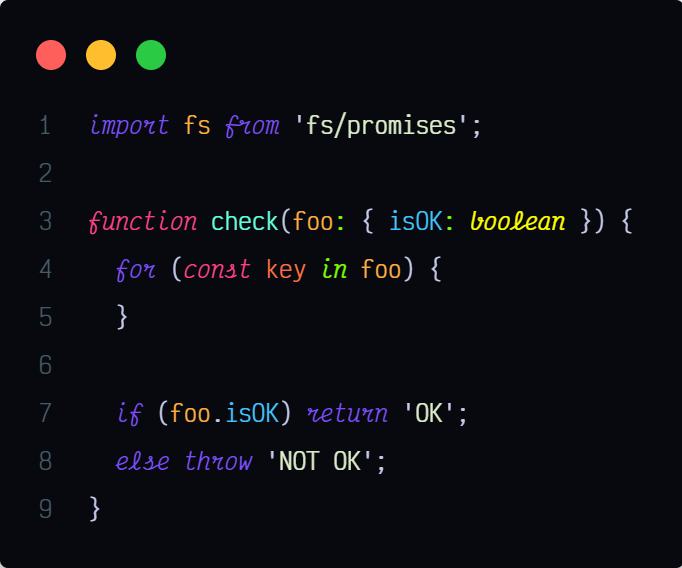
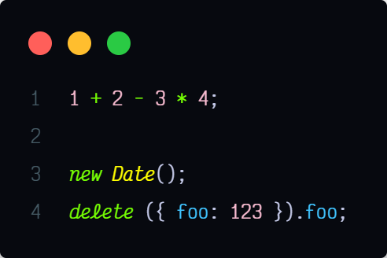
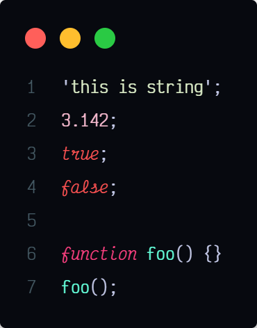
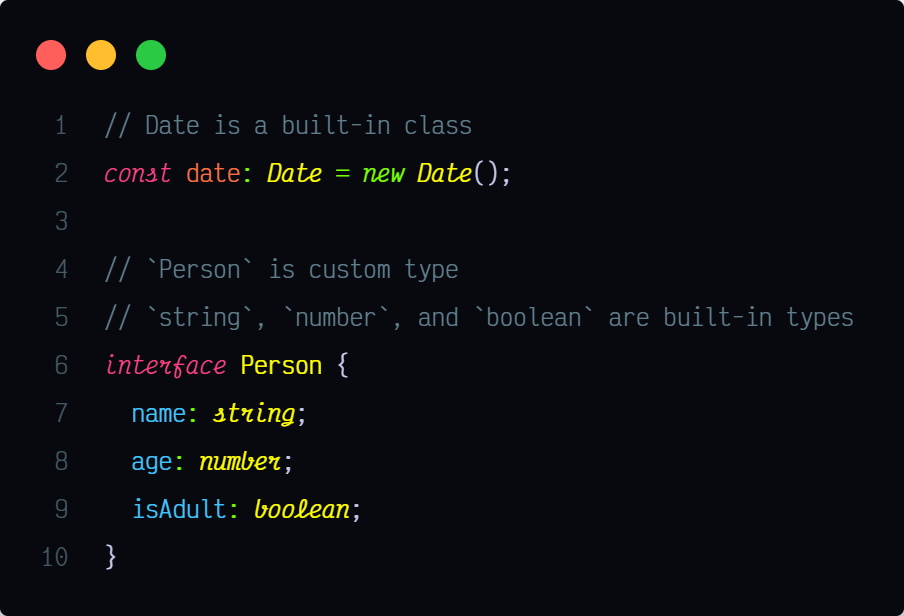
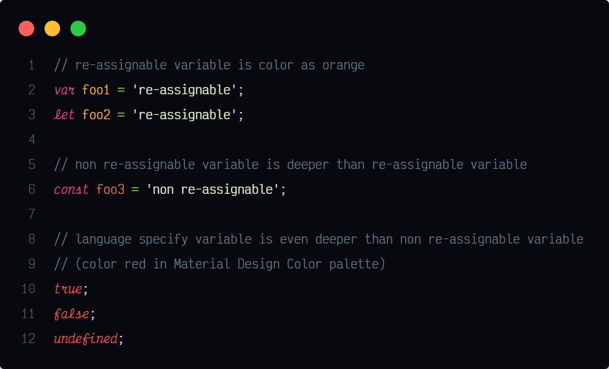
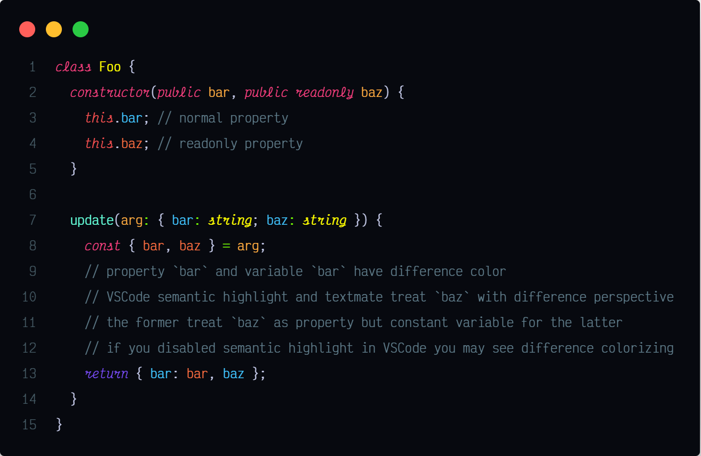
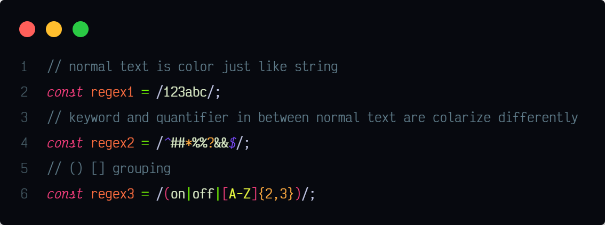

# Dark Lavender - A beautiful and useful VSCode theme

My first theme — [Dark Lavender](https://marketplace.visualstudio.com/items?itemName=t7yang.dark-lavender) was released on May 2020. You may wonder why I'd spend so much time to create a new editor theme (it is no easy to create a high quality theme), the answer is simple — I couldn't find a satisfy theme. Thank Material Design color palette, I successfully created a colorful and beautiful theme.

Being a programmer, I'm also teaching JavaScript in my free time. The teaching experience made me think about whether my theme goes beyond good looking and help my student to learn programming? So, I'd start digging into [TextMate tokens and scopes](https://code.visualstudio.com/api/language-extensions/syntax-highlight-guide#textmate-tokens-and-scopes), try to find out how to group related tokens, and give them a representative color or font styling. I believe this can help both novice and experienced developers to distinguish different tokens more efficiently.

## Language Token

Below I'll describe and demonstrate (in TypeScript) how I use different styling and color to emphasize different tokens.

Each demo provides a screenshot and inline code snippet. The screenshot gives you a preview of the actual effect, and if you want to try the snippet in your editor, you can copy and paste the inline code snippet to your VSCode.

To emphasize the italic effect, I use [Victor Mono](https://rubjo.github.io/victor-mono/) for screenshots below. If you prefer non-cursive font, [Fira Code](https://github.com/tonsky/FiraCode), [Jetbrain Mono](https://www.jetbrains.com/lp/mono/), and [Iosevka](https://github.com/be5invis/Iosevka) are some of the best choices. I use [Rec Mono](https://www.recursive.design), a high-quality variable font that supports many bold levels, ligatures, and four variants.

### Built-in

Every token such as keyword, variable, or function provided by the language or platform itself is styled as **italic**. So, try not to re-assign or change its value, if you see any italic token.



```typescript
// `import` and `from` are JavaScript keyword
import path from 'path';

// `Date` is JavaScript built-in class
Date.now();

// `JSON` is JavaScript built-in namespace
JSON.stringify({});

// `document` is provide by browser API
document.querySelector('');
```

### keyword

Almost every Programming language has predefined keywords. Dark Lavender divides them into two groups — keyword for declaration or not.

For declaration keywords (including modifier) are color as red (pink color in MD palette).



```typescript
// keyword for declare variable
const foo = 'foo';
let bar = 'bar';

// keyword for declare interface
interface ICustomError {}

// keyword for declare class or modifier
class CustomError extends Error implements ICustomError {
  constructor(public readonly code) {
    super();
  }
}
```

For non-declaration keywords (mostly statements) are color as purple.



```typescript
import fs from 'fs/promises';

function check(foo: { isOK: boolean }) {
  for (const key in foo) {
  }

  if (foo.isOK) return 'OK';
  else throw 'NOT OK';
}
```

### Operator

Operator is color as light green. You may think "What special about operator? Isn't all operators a symbol? Developer should easily distinguish for them, right?". Not really, some languages have "word like" operators like `new` and `delete` in JavaScript/TypeScript.

With a different color, now you can easily tell which keyword is operator, even you are a novice developer.



```typescript
1 + 2 - 3 * 4;

new Date();
delete { foo: 123 }.foo;
```

### Primitive Value

There is three main primitive value across almost every programming language — `string`, `number`, and `boolean`. These three primitive value has their own color;

Function may not treat as a value in many languages, but it does exist in almost every language. Not like other kinds of value, function represent the concept of logic instead of data, so function has its own color.



```typescript
'this is string';
3.142;
true;
false;

function foo() {}
foo();
```

### Types

Every built-in or custom type and class is color as yellow. In many languages, class can be both value and type, so they share the same color.



```typescript
// Date is a built-in class
const date: Date = new Date();

// `Person` is custom type
// `string`, `number`, and `boolean` are built-in types
interface Person {
  name: string;
  age: number;
  isAdult: boolean;
}
```

### Variable, Parameter and Object Property

When talking about variables in most of the non FP languages, we concern about "Is the variable re-assignable or not?". For re-assignable, non re-assignable, language specify variable, they all have their own color, respectively.



```typescript
// re-assignable variable is color as orange
var foo1 = 're-assignable';
let foo2 = 're-assignable';

// non re-assignable variable is deeper than re-assignable variable
const foo3 = 'non re-assignable';

// language specify variable is even deeper than non re-assignable variable
// (color red in Material Design Color palette)
true;
false;
undefined;
```

Parameter is acting like variable, so they share the same color for no doubt.

Object property is acting like variable too, but in Dark Lavender, object property does not share the same color with variable, because this can help developer distinguish the difference between them from the situation like destructuring or object literal shorthand.



```typescript
class Foo {
  constructor(public bar, public readonly baz) {
    this.bar; // normal property
    this.baz; // readonly property
  }

  update(arg: { bar: string; baz: string }) {
    const { bar, baz } = arg;
    // property `bar` and variable `bar` have difference color
    // VSCode semantic highlight and textmate treat `baz` with difference perspective
    // the former treat `baz` as property but constant variable for the latter
    // if you disabled semantic highlight in VSCode you may see difference colorizing
    return { bar: bar, baz };
  }
}
```

### Regular Expression

RegExp is one of the most powerful features in programming language, but it is hard to remember which character should escape or which symbol is simply a text rather than a special symbol, even for an experienced developer.



```typescript
// normal text is color just like string
const regex1 = /123abc/;
// keyword and quantifier in between normal text are colarize differently
const regex2 = /^##*%%?&&$/;
// () [] grouping
const regex3 = /(on|off|[A-Z]{2,3})/;
```

## Conclusion

As you can see, I try to group related tokens and give them a representative color or style, and I believe that this can help you learn coding and understand your code. Besides JavaScript/TypeScript, Dark Lavender also provides basic support for many mainstream languages such as CSS, HTML, Java, Go, C++, and more. I'll keep improving this theme in the future, so if you have any feedback would like to share or find any issue, please [let me know](https://github.com/t7yang/dark-lavender/issues). If you like this theme, don't forget to share, comment, and star in [VSCode marketplace](https://marketplace.visualstudio.com/items?itemName=t7yang.dark-lavender) and [github](https://github.com/t7yang/dark-lavender). Thank you.
