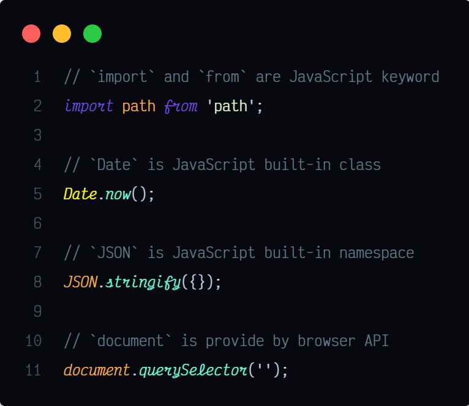
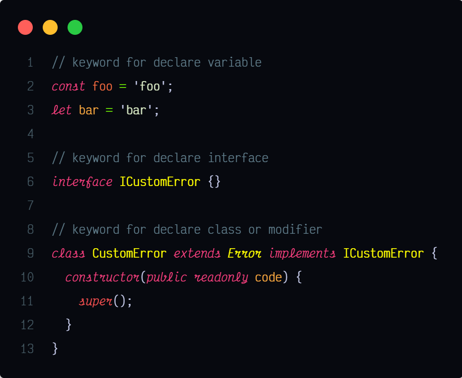

# Dark Lavender —— 華麗又實用的 VSCode 主題

我在 2020 年 5 月發布了我第一個主題—— [Dark Lavender](https://marketplace.visualstudio.com/items?itemName=t7yang.dark-lavender)。你或許會好奇我為什麼要花這麼多時間去創造一個新的主題（創造一個高品質的主題很不容易），答案其實很簡單——我找不到一個讓我滿意的主題，一個漂亮的主題。感謝 Material Design 的色票，我順利地打造了一個多彩又漂亮的主題。

做為一個開發者，在閒暇之餘我也會教授 JavaScript 。教學的經歷，讓我開始思考，我設計的主題除了好看之外，是否能夠幫助我的學生進行學習呢？所以，我開始更深入的研究 [TextMate tokens and scopes](https://code.visualstudio.com/api/language-extensions/syntax-highlight-guide#textmate-tokens-and-scopes) ，嘗試把相關的 token 找出來讓組合成一個群組，並給它們一個鮮明的色彩或不同的樣式。我相信這樣可以幫助初學者或是有經驗的開發者更快的識別不同的 token 。

## 程式語言 Token

以下會展示及說明（使用 TypeScript）如何利用不同的色彩及樣式來強調不同的 token 。

每一個展示會提供螢幕截圖及行內的程式碼片段。螢幕截圖讓你直接預覽最終的視覺效果，而如果你想在你的 VSCode 中測試這些程式碼的效果，你可以直接複製貼上底下的程式碼片段到你的編輯器。

為了強調斜體的效果，在底下的螢幕截圖中我選擇使用 [Victor Mono](https://rubjo.github.io/victor-mono/) 字型。如果你更偏好非草書的字型， [Fira Code](https://github.com/tonsky/FiraCode) 、 [Jetbrain Mono](https://www.jetbrains.com/lp/mono/) 、 [Iosevka](https://github.com/be5invis/Iosevka) 都是很好的選擇。我自己日常則使用 [Rec Mono](https://www.recursive.design) ，一個非常高水準的變數字型，支援多種粗體等級、連字效果、還有四種變體。

### 內建的

所有由語言或平台所提供的 token ，譬如關鍵字、變數、函數都會被冠以斜體的樣式。所以如何看到任何的斜體 token ，請不要試圖改變它的值。



```typescript
// `import` and `from` are JavaScript keyword
import path from 'path';

// `Date` is JavaScript built-in class
Date.now();

// `JSON` is JavaScript built-in namespace
JSON.stringify({});

// `document` is provide by browser API
document.querySelector('');
```

### 關鍵字

幾乎所有的程式語言都內定了一些關鍵字。 Dark Lavender 把它們劃分為兩個群組——用於宣告及非宣告的關鍵字。

對用於宣告的關鍵字（包含修飾器 modifier ）會上紅色（ MD 色票中的粉紅色）。



```typescript
// keyword for declare variable
const foo = 'foo';
let bar = 'bar';

// keyword for declare interface
interface ICustomError {}

// keyword for declare class or modifier
class CustomError extends Error implements ICustomError {
  constructor(public readonly code) {
    super();
  }
}
```

對非宣告的關鍵字（多數為陳述式）會上紫色。


```typescript
import fs from 'fs/promises';

function check(foo: { isOK: boolean }) {
  for (const key in foo) {
  }

  if (foo.isOK) return 'OK';
  else throw 'NOT OK';
}
```

### 運算子

運算子會上淺綠色。你或許會好奇「運算子有什麼特別的地方？運算子不都是符號而已嗎？開發者應該很容易區分它們吧？」。其實不然，一些語言具有「詞彙型」的運算子，譬如 JavaScript 或 TypeScript 有像 `new` 及 `delete` 這樣的運算子。

透過不同的上色，即使你是一個初學者，也可以很輕易的看出哪些關鍵字是運算子。


```typescript
1 + 2 - 3 * 4;

new Date();
delete { foo: 123 }.foo;
```

### 原始值

幾乎所有程式語言都具有這三種原始值（ Primitive Value）—— `string` 、 `number` 、 `boolean` 。這三種原始值擁有屬於它們自己的顏色。


```typescript
'this is string';
3.142;
true;
false;

function foo() {}
foo();
```

### 變數、參數、物件屬性

在非函數式的語言中，我們通常會關心「這個變數是否能被重新賦值」。對可重新賦值、不可重新賦值、語言指定的變數，它們分別都有屬於自己的顏色。


```typescript
// re-assignable variable is color as orange
var foo1 = 're-assignable';
let foo2 = 're-assignable';

// non re-assignable variable is deeper than re-assignable variable
const foo3 = 'non re-assignable';

// language specify variable is even deeper than non re-assignable variable
// (color red in Material Design Color palette)
true;
false;
undefined;
```

參數的行為跟變數類似，所有它們毫無疑問共用同一種顏色。

物件屬性也類似變數，但在 Dark Lavender 中，物件屬性並沒有跟變數共用顏色，因為這可以幫助開發者在某些諸如結構或物件縮寫的情況下區分兩者的不同。


```typescript
class Foo {
  constructor(public bar, public readonly baz) {
    this.bar; // normal property
    this.baz; // readonly property
  }

  update(arg: { bar: string; baz: string }) {
    const { bar, baz } = arg;
    // property `bar` and variable `bar` have difference color
    // VSCode semantic highlight and textmate treat `baz` with difference perspective
    // the former treat `baz` as property but constant variable for the latter
    // if you disabled semantic highlight in VSCode you may see difference colorizing
    return { bar: bar, baz };
  }
}
```

### 正規表達式

正規表達式可以說是程式語言中最強大之一的功能，但就算是一個有經驗的開發者，想要記住哪些字元必須跳脫、哪些符號僅為普通文字而不是特殊符號都不是一件簡單的事。


```typescript
// normal text is color just like string
const regex1 = /123abc/;
// keyword and quantifier in between normal text are colarize differently
const regex2 = /^##*%%?&&$/;
// () [] grouping
const regex3 = /(on|off|[A-Z]{2,3})/;
```

### 結論

如上所述，我嘗試把相關的 token 聚集起來然後給它們一個有代表性的顏色或樣式，我相信這樣做可以幫助你學習程式設計並更好的理解你的程式碼。除了 JavaScript 及 TypeScript 外， Dark Lavender 也針對主流的語言，譬如 CSS 、 HTML 、 Java 、 Go 、 C++ 等提供基本的支援。我會持續改善這個主題，如果你有任何的回饋或找到瑕疵，可以[通知我](https://github.com/t7yang/dark-lavender/issues)。如果你喜歡這個主題，別忘了到 [VSCode 市集](https://marketplace.visualstudio.com/items?itemName=t7yang.dark-lavender) 和 [github](https://github.com/t7yang/dark-lavender) 分享、留言、點讚或評分。